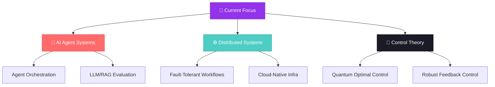

  <a href="#quantum-control">🔬 Quantum Control</a> &nbsp;·&nbsp;
  <a href="#aiml-systems">🤖 AI/ML Systems</a> &nbsp;·&nbsp;
  <a href="#systems-infrastructure">⚙️ Infrastructure</a>

 

  

  
  
  
  

  
  
  
  

---

## 🧭 Quick Navigation

  <a href="#about-me">👋 About</a> &nbsp;·&nbsp;
  <a href="#tech-stack">🛠️ Tech Stack</a> &nbsp;·&nbsp;
  <a href="#featured-projects">🚀 Projects</a> &nbsp;·&nbsp;
  <a href="#build-progress">📊 Progress</a> &nbsp;·&nbsp;
  <a href="#github-stats">📈 Stats</a> &nbsp;·&nbsp;
  <a href="#trophies">🏆 Trophies</a> &nbsp;·&nbsp;
  <a href="#unique-approach">🧭 Approach</a> &nbsp;·&nbsp;
  <a href="#focus-roadmap">🗺️ Roadmap</a> &nbsp;·&nbsp;
  <a href="#get-in-touch">📫 Contact</a>

---

## 💼 Status

  
  
  
  

---

## 📈 GitHub Stats

  
  

  

---

## 👨‍💻 About Me

$\color{#EAB308}{\texttt{\textbf{Currently pursuing Master of Technology in IIT Bombay, building AI agent systems, distributed infrastructure, and evaluation tooling,}}}$
 
$\color{#EAB308}{\texttt{\textbf{with ongoing research in quantum optimal control.}}}$

**More on my background:** [RIMC](https://rimc.edu.in) · [NDA](http://nda.nic.in) · [Research Guide: Prof. Navin Khaneja](https://scholar.google.com/citations?user=UV8w0EsAAAAJ&hl=en)

  

---

## 🛠️ Tech Stack

<strong>Languages</strong>

  
  
  
  
  
  

<strong>AI / ML & Agent Systems</strong>

  
  
  
  
  
  

<strong>Backend & APIs</strong>

  
  
  
  
  

<strong>Databases & Caching</strong>

  
  
  

<strong>DevOps & Infrastructure</strong>

  
  
  
  
  

<strong>Frontend</strong>

  
  

<strong>Tools</strong>

  
  
  

## 🚀 Featured Projects

### ⭐ Flagship: AgentOS
**Evaluation-Driven AI Agent Runtime**

An end-to-end runtime for executing, observing, and evaluating long-running AI agents (retrieval, tool orchestration, and state), built with production-grade observability from day one. Structured as a real product, not a portfolio demo: RAG pipeline, agent memory, evaluation harness, and an observability stack all wired together.

- 🔍 **Hybrid RAG pipeline:** ingestion, chunking, and pgvector-backed retrieval over PostgreSQL
- 🤖 **Agent orchestration layer:** stateful, long-running tasks with tool use and memory
- 📊 **Built-in evaluation & observability:** OpenTelemetry + Langfuse instrumentation across every run
- ☁️ **Deployed, not just built:** Next.js frontend on Vercel, FastAPI backend on Render, Neon Postgres (pgvector)

       

**→ [Live Demo](https://agent-os-weld.vercel.app/) · [Explore the repo](https://github.com/rehan-khan-007/Agent-OS)**

---

### 🤖 AI/ML & Agent Systems

| Project | Description | Tech | Live Demo | Repo |
|---|---|---|---|---|
| 📊 **EvalOS** | LLM/RAG evaluation & benchmarking framework, featuring hybrid retrieval, cross-encoder reranking, claim-level hallucination attribution, LLM-as-a-Judge scoring |     | [Visit](https://evalos-dashboard.onrender.com/) | [Repo](https://github.com/rehan-khan-007/Eval-OS) |
| 🩺 **Clinical Risk Prediction & Explainability Platform** | Full-stack ML platform for cardiovascular risk prediction, with SHAP explanations, calibrated probabilities, subgroup fairness auditing |      | [Visit](https://clinical-risk-prediction-explainabi.vercel.app/) | [Repo](https://github.com/rehan-khan-007/Clinical-Risk-Prediction-Explainability-Platform-) |

### ⚙️ Systems & Infrastructure

| Project | Description | Tech | Live Demo | Repo |
|---|---|---|---|---|
| 🔀 **Workflow Orchestration Engine** | DAG-based dependency resolution across concurrent workflows, using Redis-backed queues, worker leases/heartbeats, Kubernetes-parallel execution |     | — | [Repo](https://github.com/rehan-khan-007/Workflow-Orchestration-Engine) |
| ☁️ **Cloud-Native Code Execution Platform** | Multi-tenant Kubernetes sandboxes with a browser-based terminal (xterm.js + WebSockets) and automated pod/service provisioning |     | — | [Repo](https://github.com/rehan-khan-007/cloud-native-code-execution-platform) |

### 🎓 Academic & Research

| Project | Description | Tech | Repo |
|---|---|---|---|
| 🧠 **ML-Based BCI Wheelchair System** *(B.Tech Project, Parul University)* | SSVEP-based BCI pipeline decoding 64-channel EEG into directional commands across 35 subjects, via SVM classification on FFT-extracted flicker-frequency features |    | [📄 Report](https://github.com/rehan-khan-007/rehan-khan-007/blob/main/reports/BCI-Wheelchair-Final-Year-Project.pdf) |
| 📉 **Batch Size & Generalization** *(CS 725, IIT Bombay)* | Course research project studying the effect of batch size on generalization in deep learning models |   | [📄 Report](https://github.com/rehan-khan-007/rehan-khan-007/blob/main/reports/CS725-Batch-Size-Generalization.pdf) |

---

### 🧬 Quantum Optimal Control of Spin Systems
**M.Tech Thesis, IIT Bombay** · advisor: Prof. Navin Khaneja

Modelling spin-1/2 quantum system dynamics via Bloch sphere representation and Pauli matrices, simulating Rabi oscillations under magnetic field actuation. Implementing the GRAPE optimal control algorithm for high-fidelity quantum state preparation, extending toward Lyapunov-based feedback control and stochastic noise robustness, and comparing GRAPE, CRAB, and Lyapunov control protocols on fidelity, convergence, and noise tolerance.

    

---

## 📊 Build Progress

$\large{\textsf{AgentOS}}$ &nbsp;&nbsp;&nbsp;&nbsp;&nbsp;&nbsp;&nbsp;

$\large{\textsf{Workflow Orchestration Engine}}$ 

$\large{\textsf{EvalOS}}$ &nbsp;&nbsp;&nbsp;&nbsp;&nbsp;&nbsp;&nbsp;&nbsp;&nbsp;

$\large{\textsf{Clinical Risk Platform}}$ &nbsp;

$\large{\textsf{Cloud-Native Platform}}$ &nbsp;&nbsp;

$\color{#FF6B6B}{\normalsize{\textsf{Not a highlight reel: an honest, live snapshot of where each system actually stands, updated as they evolve.}}}$

---

## ✅ Master Technologies

- [x] Python for AI/ML systems
- [x] FastAPI / Node.js backends
- [x] Docker & Kubernetes
- [ ] Rust for systems programming
- [ ] Distributed consensus protocols

**📦 Ship Track**

- [x] 2 production-deployed platforms (AgentOS, Clinical Risk Platform)
- [x] 1 completed evaluation framework (EvalOS)
- [ ] Kubernetes-scale benchmark suite (Workflow Orchestration Engine)
- [ ] Multi-tenant cloud sandbox platform (Cloud-Native Platform)

---

## 🧭 Unique Approach

| Background | Applied As |
|---|---|
| 🔬 **Control Theory** | Optimal & feedback control framing for agent orchestration and system reliability |
| 🧠 **AI/ML Engineering** | RAG pipelines, agent evals, and observability for production LLM systems |
| ⚙️ **Systems Engineering** | Fault-tolerant, distributed execution: from Kubernetes pods to agent runtimes |
| 🎖️ **Military Academy Discipline** | Structured, benchmarked execution over ad-hoc iteration |

---

## 🗺️ Focus Roadmap

---

## 🐍 Contribution Snake

  

---

## 🏆 Trophies

  

---

## 💭 Daily Inspiration

  

---

## 📫 Get In Touch

- **📧 Email:** [bro39404k@gmail.com](mailto:bro39404k@gmail.com), for professional inquiries
- **💼 LinkedIn:** [rehan-khan-india](https://www.linkedin.com/in/rehan-khan-india), let's connect professionally
- **🐦 X:** [@rehan_khan__007](https://x.com/rehan_khan__007)
- **💻 GitHub:** [rehan-khan-007](https://github.com/rehan-khan-007)

"Systems that learn, control loops that hold." (M.Tech, Systems and Control Engineering · IIT Bombay)

