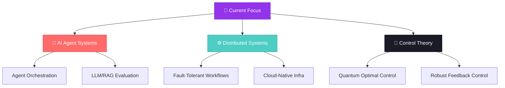

<p align="center">
  
</p>

<p align="center">
  
  
  
  
</p>

<p align="center">
  <a href="https://www.linkedin.com/in/rehan-khan-india"></a>
  <a href="mailto:bro39404k@gmail.com"></a>
  <a href="https://x.com/rehan2924p"></a>
  <a href="https://github.com/rehan-khan-007"></a>
</p>

---

## 👨‍💻 About Me

```ts
const rehan: Engineer = {
  name: "Rehan Khan",
  role: "SDE | AI/ML Engineer | Systems & Control",
  base: "M.Tech, Systems and Control Engineering — IIT Bombay",
  thesis: "Quantum optimal control of NMR spin systems (advisor: Prof. Navin Khaneja)",

  currentFocus: [
    "🧠 Evaluation-driven agent runtimes (RAG + orchestration + evals)",
    "⚙️ Distributed workflow orchestration & fault-tolerant systems",
    "☁️ Cloud-native, multi-tenant infrastructure on Kubernetes",
    "🔬 Optimal control theory applied to quantum spin dynamics",
  ],

  languages: {
    core: ["Python", "TypeScript", "C++"],
    familiar: ["SQL", "Bash"],
  },

  expertise: {
    aiMl: ["LangGraph", "RAG pipelines", "pgvector", "SHAP", "MLflow", "LLM evals"],
    backend: ["FastAPI", "Node.js", "REST APIs", "WebSockets"],
    infra: ["Docker", "Kubernetes", "Redis", "PostgreSQL", "Prometheus"],
    frontend: ["React", "Next.js", "TypeScript"],
    controlTheory: ["Optimal control (GRAPE, CRAB)", "Lyapunov methods", "Bloch sphere dynamics"],
  },

  background: [
    "🎖️ Rashtriya Indian Military College (RIMC) & NDA",
    "🎓 B.Tech, Parul University (distinction)",
    "📚 Stanford Code in Place",
  ],
};
```

---

## 🛠️ Tech Stack

<p align="center">
  
</p>

---

## 🚀 Featured Projects

<table>
<tr>
<td width="50%" valign="top">

### 🤖 [AgentOS](https://github.com/rehan-khan-007/Agent-OS)
**Evaluation-Driven AI Agent Runtime**

End-to-end runtime for executing, observing, and evaluating long-running AI agents — retrieval, tool use, and state, with production-grade observability baked in.

`Python` `LangGraph` `FastAPI` `PostgreSQL/pgvector` `Redis` `OpenTelemetry` `Langfuse` `Next.js`

<a href="https://github.com/rehan-khan-007/Agent-OS">
  
</a>

</td>
<td width="50%" valign="top">

### ⚙️ [Workflow Orchestration Engine](https://github.com/rehan-khan-007/Workflow-Orchestration-Engine)
**Fault-Tolerant Distributed Task Orchestration**

DAG-based dependency resolution across concurrent workflows, with Redis-backed queues, worker leases/heartbeats, and Kubernetes-based parallel execution.

`TypeScript` `Node.js` `Redis` `PostgreSQL` `Docker` `Kubernetes`

<a href="https://github.com/rehan-khan-007/Workflow-Orchestration-Engine">
  
</a>

</td>
</tr>
<tr>
<td width="50%" valign="top">

### 📊 [EvalOS](https://github.com/rehan-khan-007/Eval-OS)
**LLM Evaluation & Benchmarking Framework**

Reproducible pipeline for evaluating RAG and LLM systems end-to-end — hybrid retrieval, cross-encoder reranking, hallucination attribution, and LLM-as-a-Judge scoring.

`Python` `RAGAS` `DeepEval` `BM25` `Cross-Encoder` `PostgreSQL` `Typer`

<a href="https://github.com/rehan-khan-007/Eval-OS">
  
</a>

</td>
<td width="50%" valign="top">

### 🩺 [Clinical Risk Prediction & Explainability Platform](https://github.com/rehan-khan-007/Clinical-Risk-Prediction-Explainability-Platform-)
**Cardiovascular Risk Prediction, Explained**

Full-stack ML platform for cardiovascular disease risk prediction with SHAP-based explanations, calibrated probabilities, and subgroup fairness auditing.

`Python` `FastAPI` `React` `PostgreSQL` `SHAP` `MLflow` `Docker`

<a href="https://github.com/rehan-khan-007/Clinical-Risk-Prediction-Explainability-Platform-">
  
</a>

</td>
</tr>
<tr>
<td width="50%" valign="top">

### ☁️ Cloud-Native Code Execution & Development Platform
**Multi-Tenant Kubernetes Sandboxes**

Isolated, resource-quota'd Kubernetes workspaces with a browser-based terminal (xterm.js + WebSockets) and automated pod/service provisioning.

`Docker` `Kubernetes` `Node.js` `WebSockets` `Redis` `AWS S3`

</td>
<td width="50%" valign="top">

### 🧬 Quantum Optimal Control of Spin Systems
**M.Tech Thesis — IIT Bombay**

Modelling spin-1/2 dynamics via Bloch sphere & Pauli matrices; implementing GRAPE for high-fidelity quantum state preparation, extending to Lyapunov-based feedback control.

`Python` `NumPy` `Optimal Control` `GRAPE` `Lyapunov Methods`

</td>
</tr>
</table>

---

## 📊 Build Progress

<p align="left">
AgentOS &nbsp;&nbsp;&nbsp;&nbsp;&nbsp;&nbsp;&nbsp;
</p>
<p align="left">
Workflow Orchestration Engine 
</p>
<p align="left">
EvalOS &nbsp;&nbsp;&nbsp;&nbsp;&nbsp;&nbsp;&nbsp;&nbsp;&nbsp;
</p>
<p align="left">
Clinical Risk Platform &nbsp;
</p>
<p align="left">
Cloud-Native Platform &nbsp;&nbsp;
</p>

<sub>Update the numbers as you go — these are just <code>progress-bar.dev/&lt;percent&gt;</code> images.</sub>

---

## 🗺️ Focus Roadmap



---

## 📈 GitHub Stats

<p align="center">
  
  
</p>

<p align="center">
  
</p>

<p align="center">
  
</p>

---

## 🐍 Contribution Snake

<p align="center">
  
</p>

<sub>This one needs a ~2-minute one-time setup — see the "Snake animation setup" note below.</sub>

---

## 🏆 Trophies

<p align="center">
  
</p>

---

## 💭 Daily Inspiration

<p align="center">
  
</p>

---

## 📫 Connect

<p align="center">
  <a href="https://www.linkedin.com/in/rehan-khan-india"></a>
  <a href="mailto:bro39404k@gmail.com"></a>
  <a href="https://x.com/rehan2924p"></a>
  <a href="https://github.com/rehan-khan-007"></a>
</p>

<p align="center"><sub>"Systems that learn, control loops that hold." — M.Tech, Systems and Control Engineering · IIT Bombay</sub></p>


